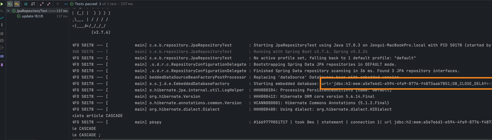
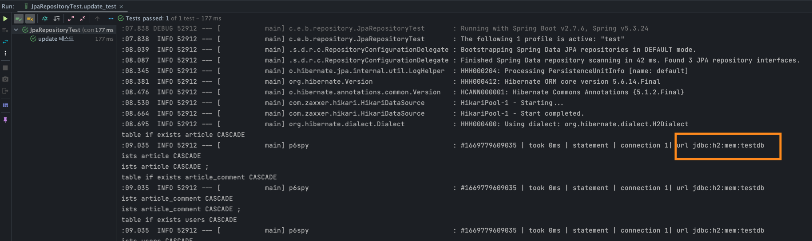
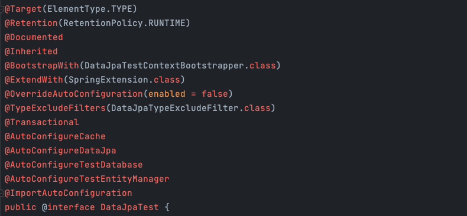

# JPA Repository TEST 작성법

```java
@ActiveProfiles("test")
@DisplayName("JPA 연결 테스트")
@Import(JpaRepositoryTest.TestJpaConfig.class)
@DataJpaTest
class JpaRepositoryTest {

    private final ArticleRepository articleRepository;
    private final ArticleCommentRepository articleCommentRepository;
    private final UserRepository userRepository;

    // 생성자 주입 패턴
    public JpaRepositoryTest(@Autowired ArticleRepository articleRepository,
                             @Autowired ArticleCommentRepository articleCommentRepository,
                             @Autowired UserRepository userRepository
    ) {
        this.articleRepository = articleRepository;
        this.articleCommentRepository = articleCommentRepository;
        this.userRepository = userRepository;
    }
}
```

### @ActiveProfiles("test")

---

- `@ActiveProfiles("test")`: spring profile을 설정 할 수 있다.
  - 기본적으로 h2 dependency를 사용하면, test 사용시에 h2 dependency를 사용한다.
  - 따라서 명시할 필요는 없지만, 테스트 코드의 profile을 코드에 명시할 수 있다.

```java
import org.junit.jupiter.api.Test;
import org.springframework.boot.test.context.SpringBootTest;
import org.springframework.test.context.ActiveProfiles;

@ActiveProfiles("test")
@SpringBootTest
class BoardToyProjectApplicationTests {

    @Test
    void contextLoads() {
    }

}
```

- 기본 Test 코드에서 ActiveProfiles를 명시하면 test profile 환경에서 spring boot 환경을 구성할 수 있다.

```yaml
spring:
  config:
    activate:
      on-profile: test
  datasource:
    url: jdbc:h2:mem:testdb
    driver-class-name: org.h2.Driver
```

### 실행 했지만 testDB 사용하지 않음!

---



### 해결 방법

---



```yaml
spring:
  config:
    activate:
      on-profile: test
  datasource:
    url: jdbc:h2:mem:testdb;MODE=MariaDB;DATABASE_TO_LOWER=TRUE
    driver-class-name: org.h2.Driver
  test:
    database:
      replace: none
```

- [h2 mode](https://www.h2database.com/html/features.html#compatibility)
  - 예1 : postgre: `url: jdbc:h2:mem:testdb;MODE=PostgreSQL;DATABASE_TO_LOWER=TRUE;DEFAULT_NULL_ORDERING=HIGH`
  - 예2 : mariadb: `url: jdbc:h2:mem:testdb;MODE=Mariadb`

### @DataJpaTest

---



- 기본적으로 `@Transactional`이 걸려있다.
  - 테스트를 돌릴 때 `@Transactional`의 기본 값은 **Rollback**으로 동작한다.
  - 따라서 Update 테스트 할시에는 `saveAndFlush()` 또는 `flush()`를 실행해야 한다.

```java
@DisplayName("update 테스트")
@Test
void update_test() {
    // given
    Article article = articleRepository.findById(1L).orElseThrow();
    String updatedHashtag = "#springboot";
    article.setHashtag(updatedHashtag);

    // when
    Article savedArticle = articleRepository.saveAndFlush(article);
//        articleRepository.flush();

    // then
    assertThat(savedArticle).hasFieldOrPropertyWithValue("hashtag", updatedHashtag);
}
```

- `@DataJpaTest`: 슬라이스 테스트 용도로 SpringBoot Bean으로 등록을 안한 상태에서 테스트를 한다. 이를 그러면 Config를 포함할 것을 추가해야한다.
  - `@Import(JpaRepositoryTest.TestJpaConfig.class)`

### 생성자 주입 패턴

---

```java
class JpaRepositoryTest {

    private final ArticleRepository articleRepository;
    private final ArticleCommentRepository articleCommentRepository;
    private final UserRepository userRepository;

    // 생성자 주입 패턴
    public JpaRepositoryTest(@Autowired ArticleRepository articleRepository,
                             @Autowired ArticleCommentRepository articleCommentRepository,
                             @Autowired UserRepository userRepository
    ) {
        this.articleRepository = articleRepository;
        this.articleCommentRepository = articleCommentRepository;
        this.userRepository = userRepository;
    }
}
```

- `@AutoWired private ArticeRepository articleRepository` 로 주입을 받아도 된다.


